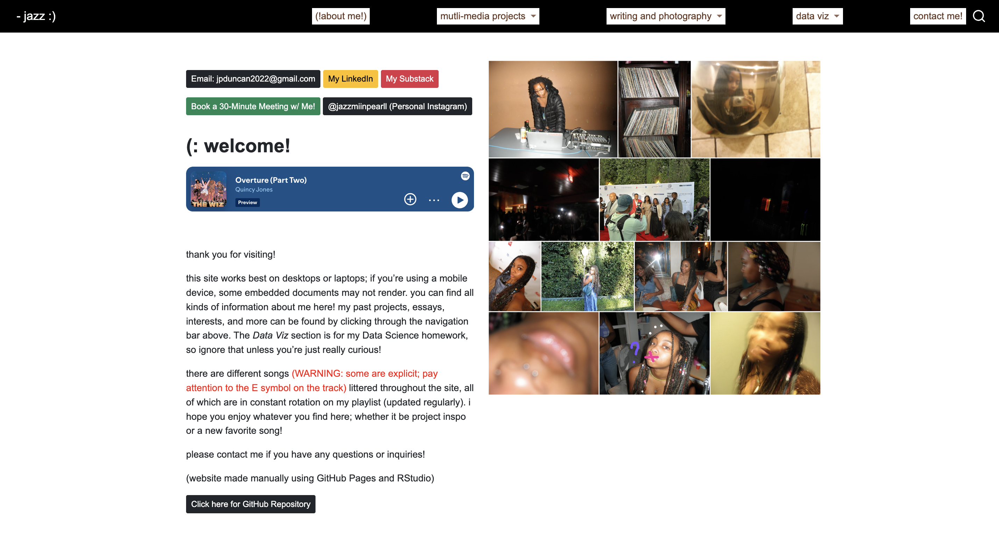
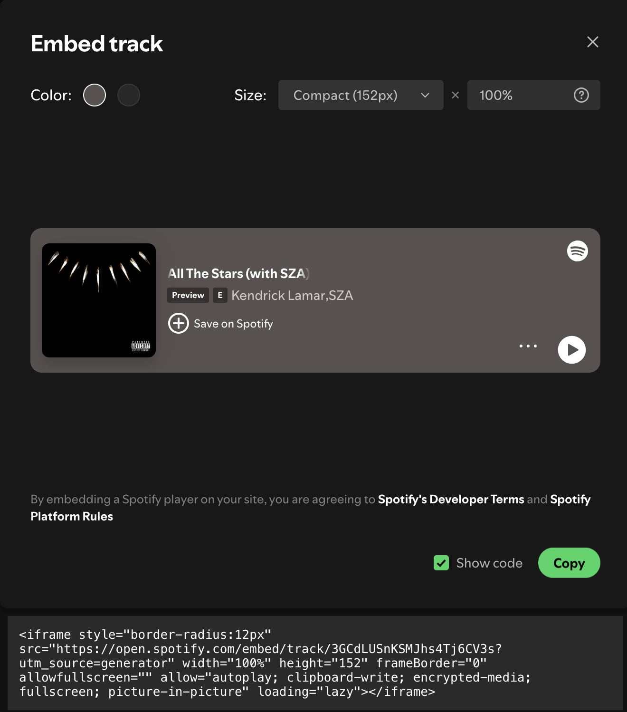

## Introduction
- General Overview of Site-Building Process
  - specifically interactive elements
- Explanation of My Intentions
- Independent Project (housed on site) Overview 
- Plans Moving Forward

## Developing the "Look" and Interactive Elements



## Techincal Implementations

- CSS Styling and Color Selection
- HTML Embedded Songs, Playlists, and Videos
- Buttons and Outside Links

## Visual Elements
### CSS Styling
```{css}
h1.title {
    color: #633822 !important; 
    text-align: center; 
    font-size: 2.5em; 
}

.navbar-nav .nav-item:nth-child(1) a {
  color: #633822 !important; 
  background-color: rgba(255,255,255,1);
  padding: 2px 6px; 
  border-radius: 0px; 
}
```

### HTML Image Insertions

```{html}
[Images](insert link/file path here)
```
## Interactive Elements
### Embedded Songs 


## Interactive Elements

### Embedded Videos
```{html}

  <div style="text-align: center;">
    <video width="640" height="360" controls>
      <source src="projects/Anthro.mp4" type="video/mp4">
      unfortunely your browser cannot play the video :(.
    </video>
  </div>

```

## Interactive Elements
### Buttons
```{html}
[LinkedIn](https://www.linkedin.com/in/jazzmin-pearl-duncan){.btn .btn-warning .btn-sm} [Substack](https://euphoniousthegreat.substack.com/){.btn .btn-danger .btn-sm}
```

## My Intentions and Applications
- Continued Use as a Professional site
- Archival Functionality
- Digital Art Sandbox/Junk Bin

## Indep. Natal Chart Visualizatoin Project

- Data Viz as Storytelling
- HTML Implementation
- Python Integration for Back-end

<iframe src="https://jazzminpearlduncan.github.io/Website-Project/multi/astro/Arbistrology.html" width="100%" height="300px"></iframe>

## Moving Forward
- Indep. Visualization Projects
- Integrating Processing and other languages for interactive digital art

```{=html}
 <div style="text-align: center;">
    <video width="640" height="360" controls>
      <source src="processing.mov" type="video/mp4">
      unfortunely your browser cannot play the video :(.
    </video>
  </div>
```